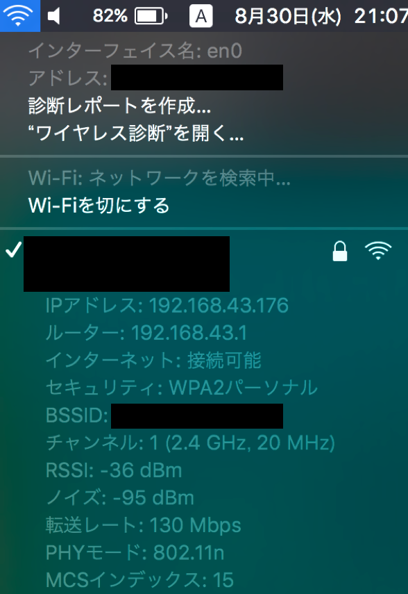
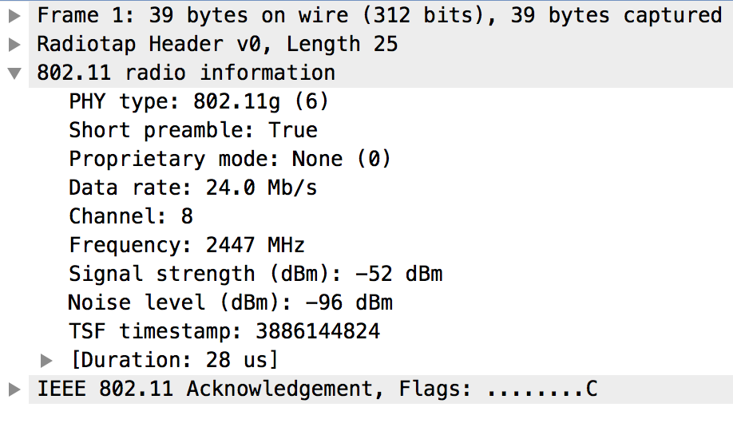
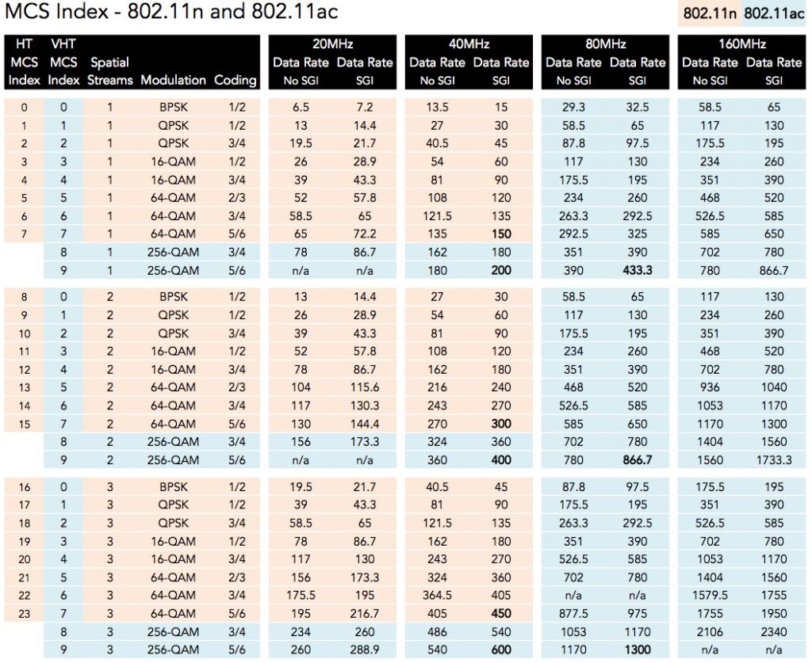

# メモ
## 目次
1. [IEEE802.11](#1)
2. [規格書](#2)
3. [無線勉強サイト](#3)

# <a name='1'> IEEE802.11 </a>
## 1. Wifiの詳細情報
### Ctrl + Alt + 無線マーク (Mac)

### Wireshark (Promiscuous & MonitorMode)

### tshark (Promiscuous & MonitorMode)
```
$ tshark -i <interface> -I
```
[参考1](http://keijir.hatenablog.com/entry/20120417/1334675091)
[参考2](http://oxynotes.com/?p=7969)
[参考3](http://n.pentest.ninja/?p=202)
## 2. MSC (Modulation and Coding Scheme)

## 3. RSSI
### airport (Mac)
#### シンボリックリンクの作成
```
$ sudo ln -s /System/Library/PrivateFrameworks/Apple80211.framework/Versions/Current/Resources/airport /usr/local/bin/airport
```
#### 実行
```
$ airport -s
```

----
# <a name='2'> 規格書 </a>
- Bluetooth：　http://www.bluetooth.com/  
- ワイヤレスLAN：　http://standards.ieee.org/wireless/  

---
# <a name='3'> 無線勉強サイト </a>
## つながるワイヤレス通信機器の開発手法  
||サブタイトル|URL|
|:--:|:--:|:--:|
|1|仕様を理解する|http://www.kumikomi.net/archives/2002/09/11com01.php?page=1|
|2|製品機能を決める|http://www.kumikomi.net/archives/2002/10/14com02.php|
|3|概要設計を行う|http://www.kumikomi.net/archives/2002/12/16com03.php?page=1|
|4|ハードウェアとソフトウェアを切り分ける|http://www.kumikomi.net/archives/2003/02/04com04.php|
|5|ハード/ソフトの切り分けとBluetooth新プロファイル|http://www.kumikomi.net/archives/2003/03/07com05.php|
|6|原理設計を行う　通信工学のおさらい|http://www.kumikomi.net/archives/2003/04/09com06.php|
|7|続・原理設計を行う　 通話の原理から通信を学ぶ|http://www.kumikomi.net/archives/2003/08/16com07.php?page=1|
|8|アーキテクチャ設計を行う|http://www.kumikomi.net/archives/2003/09/18com08.php|
|9|開発・検証環境を整備する|http://www.kumikomi.net/archives/2004/02/03com09.php|
|10|ASICを設計する（前編）　送信側のデータ処理の実装|http://www.kumikomi.net/archives/2004/03/06com10.php|
|11|ASICを設計する（中編）　エラー訂正回路とタイミング回路の実装|http://www.kumikomi.net/archives/2004/04/09com11.php?page=1|
|12|ASICを設計する（後編）　CPUと周辺回路のインターフェース回路の実装|http://www.kumikomi.net/archives/2004/05/11com12.php|
|13|ファームウェアを設計する|http://www.kumikomi.net/archives/2004/09/17com13.php|
|14|ファームウェアを設計する（その2）　──エラー制御と高周波制御を実現する方法|http://www.kumikomi.net/archives/2004/10/19com14.php|
|15|プロトタイプを開発する|http://www.kumikomi.net/archives/2005/01/01com15.php?page=1|
|16|デバッグを行う|http://www.kumikomi.net/archives/2005/03/04com16.php|
|17|市場に受け入れられる製品は何かを見極める|http://www.kumikomi.net/archives/2005/04/06com17.php?page=1|
